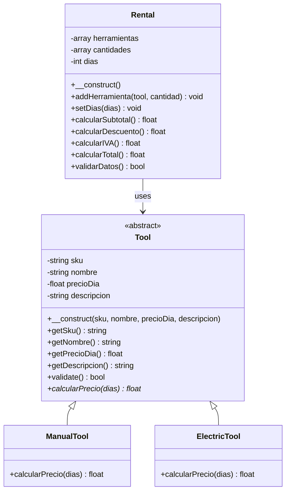

# UML Class Diagram - Tool Rental System

## Class Diagram



## Alternative ASCII Representation

```
                    ┌─────────────────────────────┐
                    │        <<abstract>>         │
                    │           Tool              │
                    ├─────────────────────────────┤
                    │ - sku: string               │
                    │ - nombre: string            │
                    │ - precioDia: float          │
                    │ - descripcion: string       │
                    ├─────────────────────────────┤
                    │ + __construct(sku, nombre,  │
                    │   precioDia, descripcion)   │
                    │ + getSku(): string          │
                    │ + getNombre(): string       │
                    │ + getPrecioDia(): float     │
                    │ + getDescripcion(): string  │
                    │ + validate(): bool          │
                    │ + calcularPrecio(dias: int):│
                    │   float <<abstract>>        │
                    └─────────────────────────────┘
                                  △
                                  │
                            ┌─────┴─────┐
                            │           │
                    ┌───────▼──────┐  ┌─▼─────────────┐
                    │  ManualTool  │  │ ElectricTool  │
                    ├──────────────┤  ├───────────────┤
                    │              │  │               │
                    ├──────────────┤  ├───────────────┤
                    │ + calcular   │  │ + calcular    │
                    │   Precio     │  │   Precio      │
                    │   (dias:int):│  │   (dias:int): │
                    │   float      │  │   float       │
                    └──────────────┘  └───────────────┘

┌─────────────────────────────┐
│          Rental             │
├─────────────────────────────┤
│ - herramientas: array       │
│ - cantidades: array         │
│ - dias: int                 │
├─────────────────────────────┤
│ + __construct()             │
│ + addHerramienta(tool: Tool,│
│   cantidad: int): void      │
│ + setDias(dias: int): void  │
│ + calcularSubtotal(): float │
│ + calcularDescuento():float │
│ + calcularIVA(): float      │
│ + calcularTotal(): float    │
│ + validarDatos(): bool      │
└─────────────────────────────┘
              │
              │ uses
              ▼
        ┌─────────┐
        │  Tool   │
        └─────────┘
```

## Class Descriptions

### Tool (Abstract Class)
- **Purpose**: Base class for all tools in the rental system
- **Attributes**:
  - `sku`: Unique identifier for the tool
  - `nombre`: Name of the tool
  - `precioDia`: Daily rental price
  - `descripcion`: Tool description
- **Key Methods**:
  - `calcularPrecio(dias)`: Abstract method to calculate rental price (implemented by subclasses)
  - `validate()`: Validates tool data according to business rules

### ManualTool
- **Purpose**: Represents manual tools with standard pricing
- **Pricing**: Base price without surcharges

### ElectricTool
- **Purpose**: Represents electric tools with surcharge
- **Pricing**: Base price + 25% surcharge

### Rental
- **Purpose**: Manages the rental transaction and calculations
- **Key Features**:
  - Manages multiple tools with quantities
  - Applies 10% discount for rentals ≥ 7 days
  - Calculates 21% IVA
  - Validates all rental data

## Business Rules

### Pricing Formula
- **Manual Tools**: `precio = precioDia * dias * cantidad`
- **Electric Tools**: `precio = precioDia * 1.25 * dias * cantidad`
- **Discount**: 10% if `dias >= 7`
- **IVA**: 21% of subtotal
- **Total**: `subtotal + IVA`

### Validation Rules
- Cantidad > 0
- Días > 0  
- Precio día ≥ 0
- SKU and nombre not empty

## Example Data
| SKU     | Nombre            | Tipo      | Precio/día (€) | Descripción        |
|---------|-------------------|-----------|----------------|--------------------|
| HMR-01  | Martillo carpintero| Manual   | 2.50           | Mango madera 500g  |
| WREN-02 | Llave inglesa     | Manual    | 3.00           | Ajustable 12"      |
| DRL-10  | Taladro percutor  | Eléctrica | 8.50           | 800 W Bosch        |
| GEN-50  | Generador portátil| Eléctrica | 45.00          | 5 kW gasolina      |